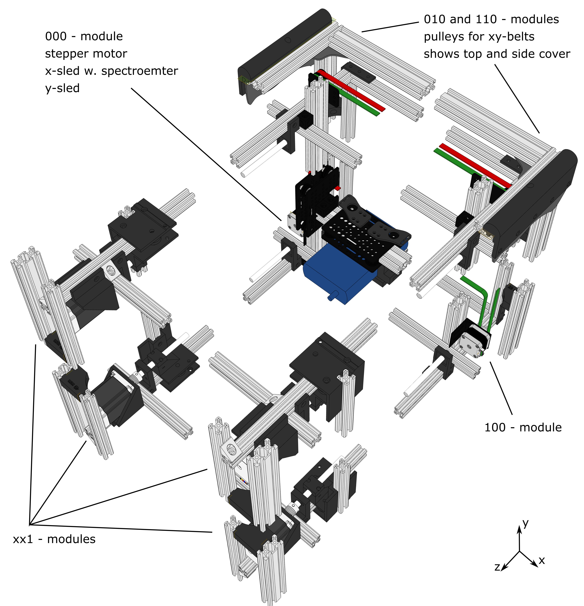
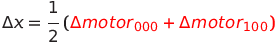
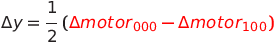
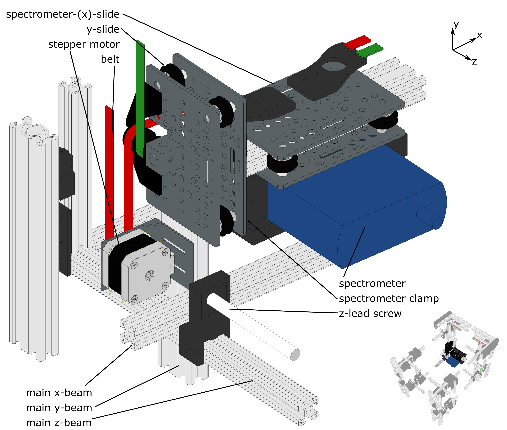
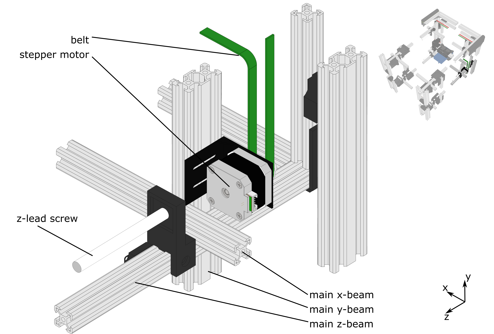
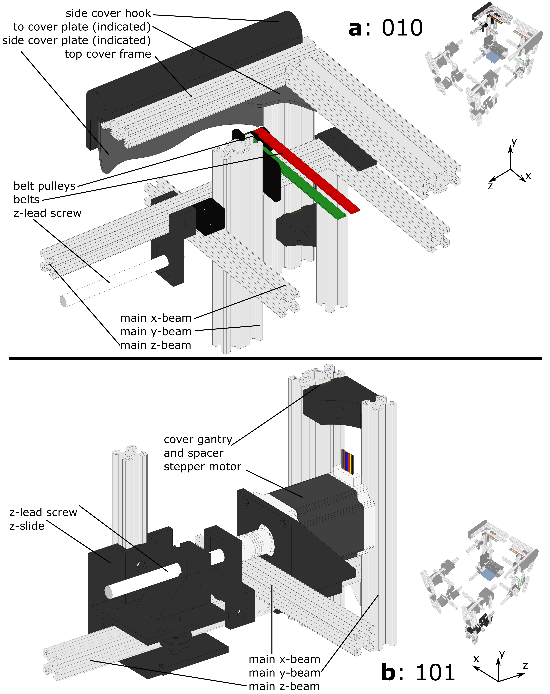
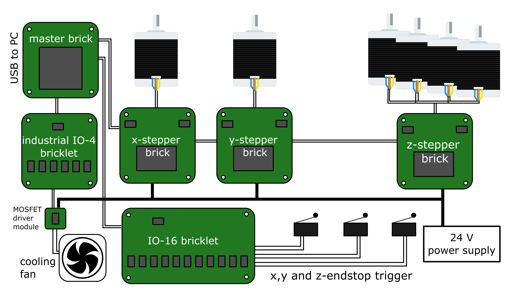

# Mechanical Setup
The mechanical setup of the scanning device was built to move the spectrometer in x- and y-direction and the light source in z-direction. The scaffold hosting all other mechanical parts is set up with OpenBuilds linear aluminium rails with a length of 1 m. The main scaffold is built up from 12 main beams, namely 4 for every axis. In the following picture, these beams are labelled as main x-beam, main y-beam and main z-beam. Further on, the setup can be subdivided in 4 module types, each presenting one or more corners of the cubic device. To give a general overview, these modules are shown in following pictures as CAD-drawing as they are assembled in the actual device. Assigned colours do not always correspond to real colours but were chosen as visual aid. In addition, parts of the aluminium rails between the modules are cut out. The mechanical structure is self designed, the following parts or assemblies are customly designed, 3D-printed and displayed in dark grey in CAD-figures. They can be found [here](./ND-Radiometry-Scanner).

The modules are named after their position in the coordinate system being scanned by the device. Following this rule, the module which is closest to the origin of the coordinate system is called 000-module.  The individual modules are described in more detail and figure exerts below. 

See also the [3D-pdf](./DOCUMENTATION/ND-Radiometry-Scanner/ND-Radiometry-Scanner.pdf) of the complete assembly.

### 000-module

The 000-module including the x/y-slid system moving the spectrometer. The Core-XY technique is used to move this slide system. One of two motors needed for this system is visible, connected to the red belt. The spectrometer is mounted on the slide moving in x-direction on an aluminium beam rail. This rail is held by the two slides moving in y-direction on two main y-beams as rails. The general equations describing the movement of the spectrometer in x- and y-directions are:

and

### 100-module
The second motor moving the spectrometer is visible in the following figure, connected to the green belt. Here the y-slide is omitted for a better display of the main x, y and z-beam. The latter also hosts the z-lead screw, which is driving the z-slide. The belts for the x/y-slits are deflected by pulleys at the 010 and 110 position. 

### 010- and 101-module
To protect the scanning device from interfering light, the device can be covered with black polypropylene panels. The panel on the top side is mounted on a frame of aluminium beams and is screwed to the main scaffold. On this top cover frame, the side cover panels can be mounted by hanging them on the aluminium beams of the top cover. The hanging panels are then fixed at the cover gantry, which consists of aluminium rails connected with spacers to the main scaffold. The scaffold and spacers are shown in all CAD-figures, however, they are best visible in the following figure. This figure also shows one of 4 modules driving the z-slide assembly. This assembly consists of four slides running in all main z-beams as rails. The slides are all driven by a lead-screw and a stepper motor, moving only at the same time. The z-slides can be connected by aluminium beams to establish a moving scaffold for hosting the light source.

## Tips to setup a new device

Start setting up the x/y frame and include the slides. Then you can install and test the electronixs for the x/y movement without too much space demands. Then yo can expand to the full frame and integrate the z-movement parts.

# Electric setup
The following figure shows a schematic setup of the used tinkerforge bricks to control the device. The master brick is connected to the PC running the controlling software. All bricks are stacked on top of each other, all bricklets are connected via cables. Each stepper brick is controlling one stepper motor for the x- and y-movement. Another stepper brick is controlling all stepper motors for the z-movement. One IO-16-bricklet is used to watch the end-stop triggers. A 24 V wall plug power supply is powering the stepper bricks as well as the cooling fan of the tinkerforge assembly. The used spectrometer and the power supply are connected directly to the PC via USB.

# List of Parts

|  | Rails |
| --- | --- |
|12	|1000x20x20 V-slot rail|
|4	|860x20x20 V-slot rail|
|2	|913x20x20 V-slot rail|
|1	|975x20x20 V-slot rail|
|6	|1000x40x20 V-slot rail|
|2	|960x40x20 V-slot rail|
|1	|810.4x40x20 V-slot rail|

|	|OpenBulids Parts|
| --- | --- |
|2	 |idler pulley plate|
|2	 |NEMA 17 90deg mount plate|
|8	 |straight bracket|
|18	 |Three way cube|
|12	|6\,mm spacer|
|16	|asymmetric spacer|
|2	|Gantry Plate - universal|
|4	|Gantry Plate - universal (cut to fit belts)|
|8	|smooth idler pulley assembly|
|24	|V-Slot wheel assembly|

| | Screws and Nuts|
| --- | --- |
|32	|M3 nut|
|16	|M3 square nut|
|32	|M3x10 ISO 7380|
|8	|M3x25 ISO 7380|
|12	|M3x8 ISO 7380|
|16	|M4 nut|
|16	|M4x10|
|4	|M5 1mm spacer|
|82	|M5 nut|
|154	|M5 tee nut|
|165	|M5 washers|
|6	|M5x20 ISO 7380|
|16	|M5x35 ISO 7380|
|12	|M5x40 ISO 7380|
|8	|M5x60 ISO 4762|
|65	|M5x8 ISO 10642|
|137	|M5x8 ISO 7380|
	
| | Moving and Other|
| --- | --- |
|2	 |16 teeth HTD 3M  9mm belt pulley|
|8	 |19x10x5 ball bearing|
|4	 |6mm/10mm coupling|
|4	 |leadscrew Tr.10x3x1000|
|4	 |Tr.10 x 3 hex nut length15mm width17mm|
|5	|3x1000x1000 black PP |
|13|\m	HTD 3M  9mm belt|

| | Printed Parts|
| --- | --- |
|8	 |cover gantry spacer|
|4	 |leadscrew end holder|
|4	 |leadscrew support|
|1	 |spectrometer clamp |
|4	 |z-motor mount|
|4	 |z-slide|
|2	|belt attachment|
|3	|limit switch mount|
|2	|pulley support|
|8	|side cover kook|
	
| | Electronic Parts|
| --- | --- |
|2	 |NEMA 17 stepper motor|
|4	 |NEMA 23 motor|
|1	|24V power supply|
|6 m|	end switch cable|
|1	|Industrial IO-4 bricklet|
|1	|IO-16 bricklet|
|3	|limit switch|
|1	|master brick|
|1	|micro usb cable|
|1	|mosfet driver module|
|3	|stepper brick|
|15 m|	stepper motor cable|
|2	|tinker forge cable|

# Capillary Reactor Models

The CAD-models of the reactors used in the linked publication can be found [here](./Reactors/).